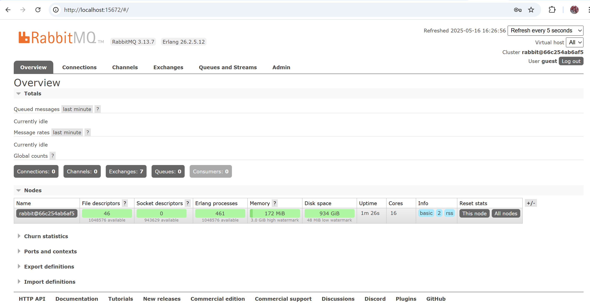
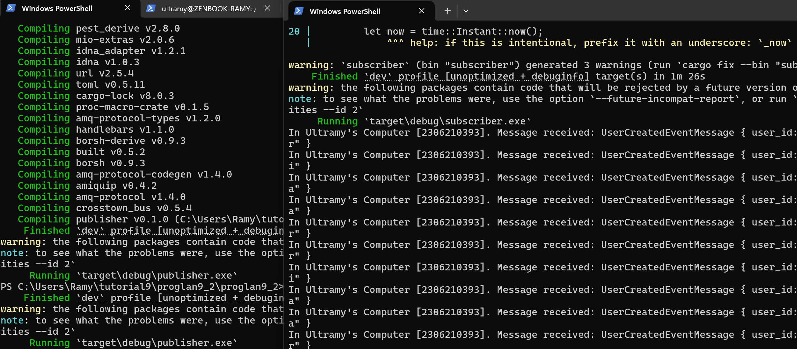
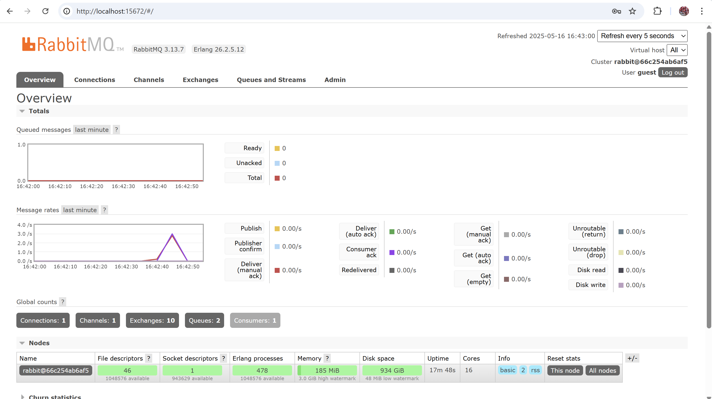
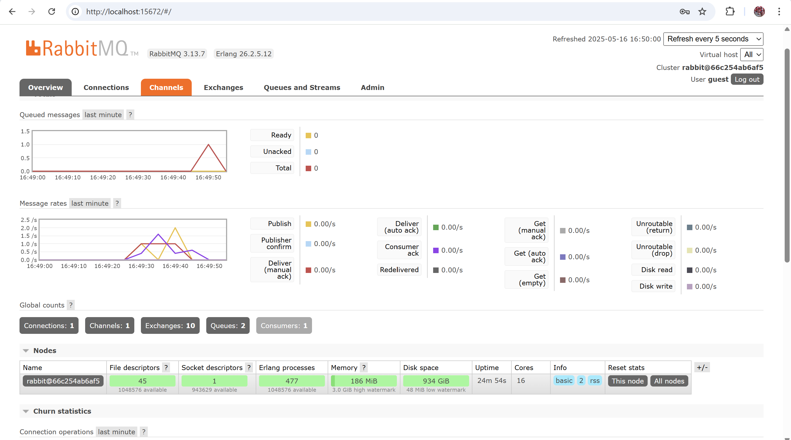
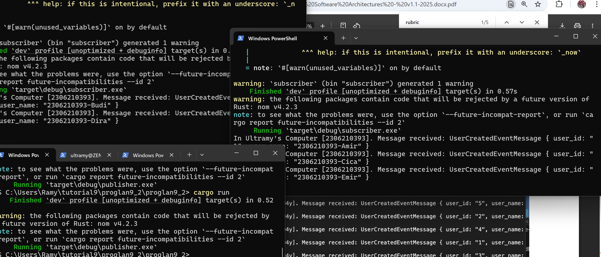

a. It depends on message size and count. The publisher sends one message at a time. Total data is the sum of all message sizes.

b. Same URL means same server. Both use same login and port.They can share queues to communicate.

This screenshot shows a Publisher-Subscriber pattern in Rust to send and process user-created events  using message queues.

The spike happened because there were no messages before, then we sent messages by running publisher.

My total queue was 1 because a message was briefly queued before being consumed, and thread::sleep(ten_millis) slowed publishing, creating a gradual curve at message rates graph.

The spike died faster because we have 2 consoles to process the messages concurrently.